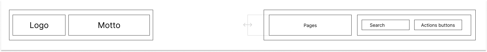

### FjordNavigation

FjordNavigation is package of small modules containing the most common navigation design. Every navigation variation is unique and is created for specific design uses shown in example.png.

List of variations:
- [FitnerdLike](d): Variation created for [Fitnerd]() website. Contains logo, motto, pages (with links), search button and action pages.
  
- [ColoredLine](d): Simple variation that contains non-structured inline navigation